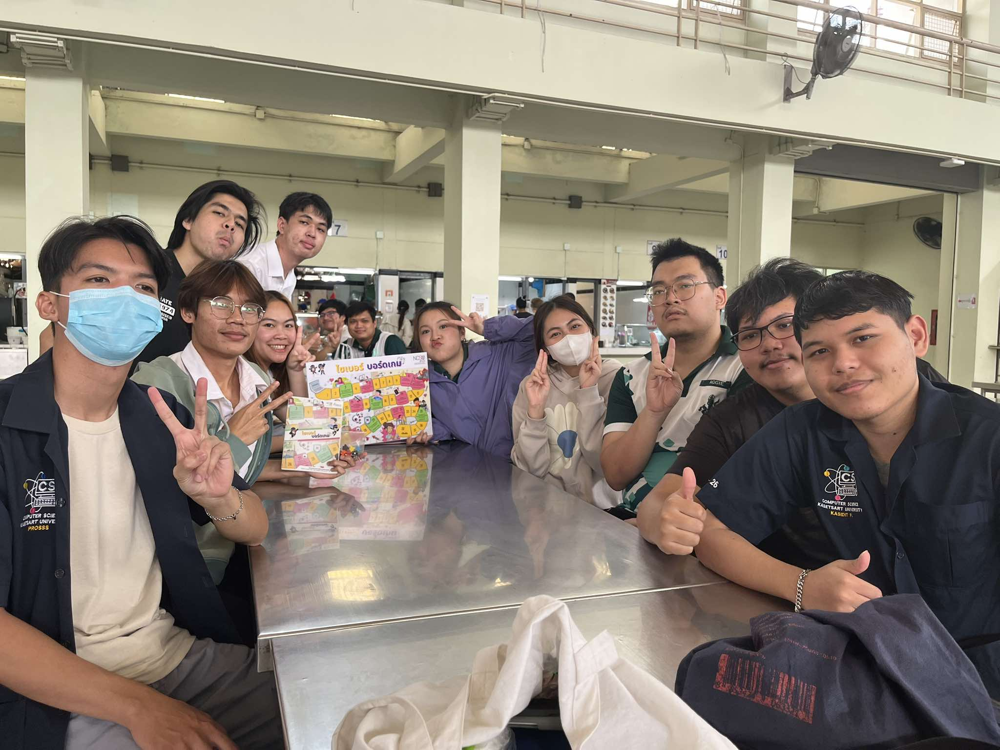
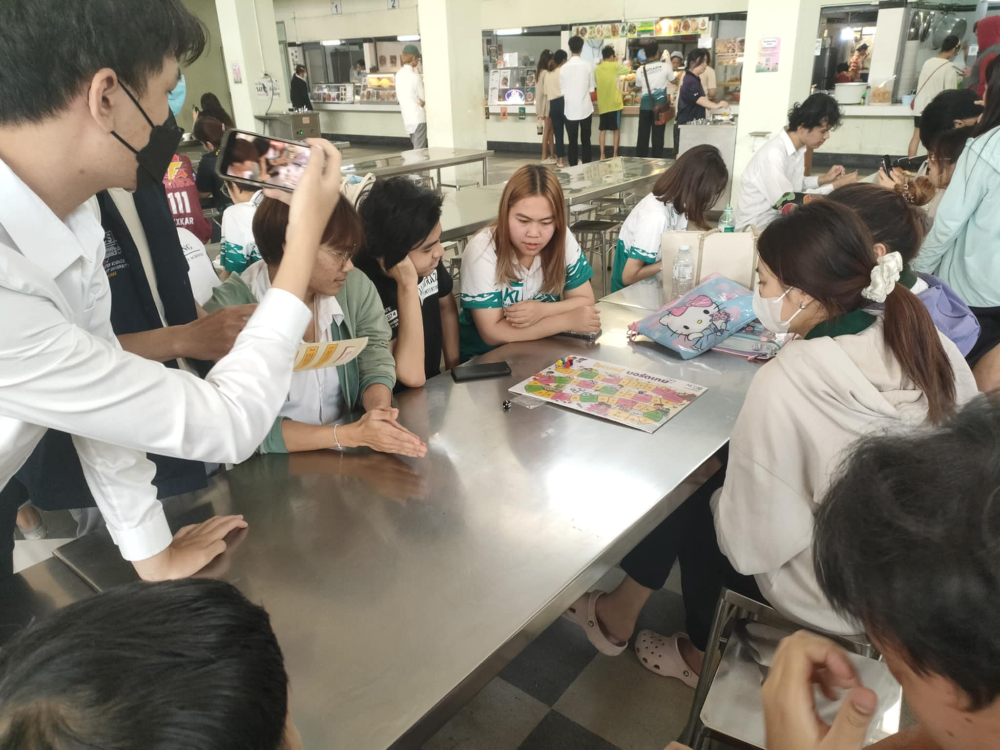
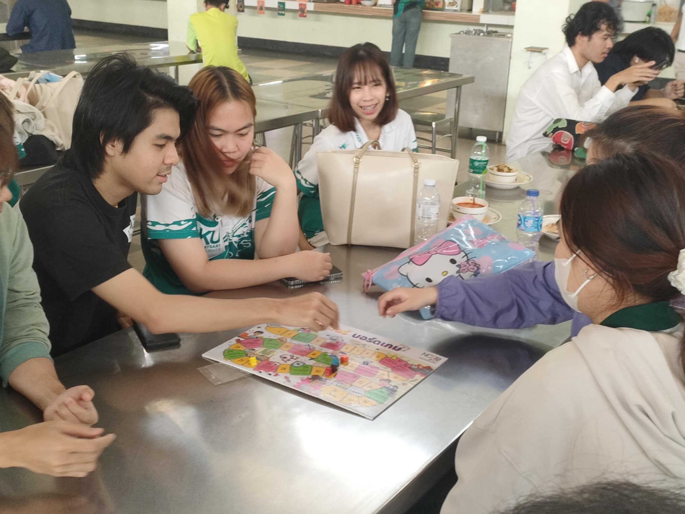
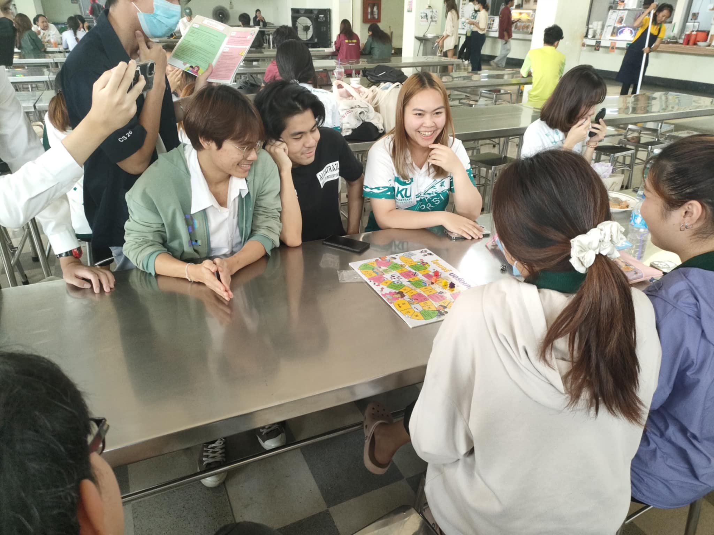
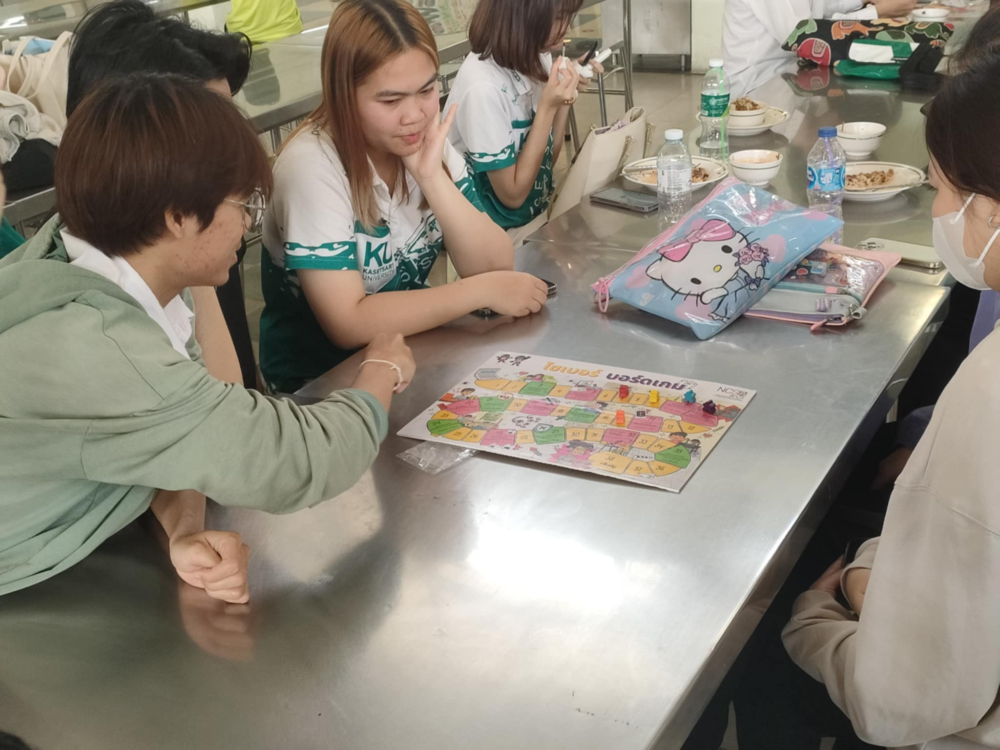

# Board Game Cyber Security

## 🌟 กิจกรรมบอร์ดเกมเพื่อความปลอดภัยไซเบอร์

**จัดโดย:** สำนักงานคณะกรรมการการรักษาความมั่นคงปลอดภัยไซเบอร์แห่งชาติ (NCSA)

กิจกรรมนี้จัดขึ้นเพื่อเสริมสร้างความรู้เกี่ยวกับ Cybersecurity ผ่านการเล่นบอร์ดเกม โดยมีนักศึกษาสาขาวิทยาการคอมพิวเตอร์เข้าร่วมอย่างกระตือรือร้น ตัวบอร์ดเกมถูกออกแบบให้มีความรู้ด้าน Cybersecurity แทรกอยู่ในช่องพิเศษ ทำให้ผู้เล่นได้รับทั้งความสนุกและความรู้ไปพร้อมกัน

ผู้เข้าร่วมส่วนใหญ่ให้ความเห็นว่าเป็นครั้งแรกที่ได้สัมผัสกับหัวข้อนี้ และการเล่นเกมนี้ช่วยให้พวกเขาเข้าใจและสนใจในเรื่องความปลอดภัยไซเบอร์มากยิ่งขึ้น บรรยากาศเป็นกันเอง พร้อมการแลกเปลี่ยนมุมมองและความคิดเห็นตลอดช่วงกิจกรรม

---

## 🏢 สถานที่จัดกิจกรรม

- **สถานที่:** โรงอาหาร มหาวิทยาลัยเกษตรศาสตร์ วิทยาเขตศรีราชา
- **วันที่:** 23 มกราคม 2025

---

## 🌟 ผู้เข้าร่วมกิจกรรม

- นักศึกษาปี 3 คณะวิทยาการจัดการ สาขาบัญชี จำนวน **3 คน**
- ทีมงาน **2 คน**

---

## 📸 ภาพบรรยากาศกิจกรรม

---

## 🎥 วิดีโอไฮไลต์กิจกรรม

---

## 👥 สมาชิกทีม

1. [Panyawat](https://top123321.github.io/boardgame)
2. [Jetnipat](https://JetnipatMark.github.io/boardgame)
3. [Kasidit](https://kasidit1647.github.io/boardgame)
4. [Suraphak](https://titigerherb.github.io/boardgame)
5. [Purin](https://phaipy.github.io/boardgame)
6. [Kittithorn](https://Kitty340822.github.io/boardgame)

---

📚 **ขอบคุณทุกท่านที่เข้าร่วมกิจกรรม!** 🎉

