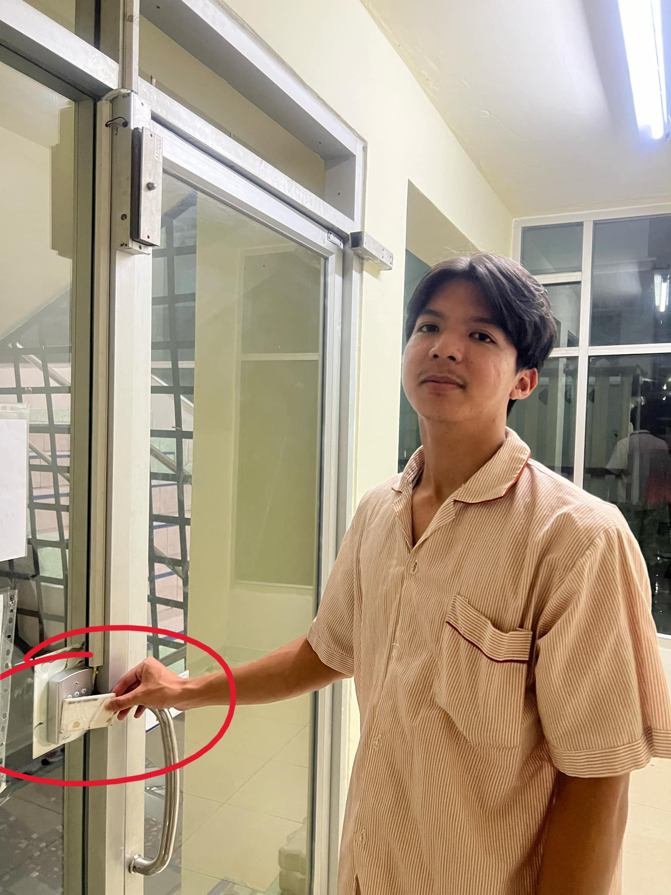

# 🛡️ Security Control In Daily Life  

  

🔑 นี่คือ **คีย์การ์ด** ที่ใช้ในการปลดล็อกประตูสำหรับเข้าและออกหอพักของผมเองครับ  
เฉพาะผู้ที่มีคีย์การ์ดของหอพัก (**ผู้ได้รับอนุญาต/มีสิทธิ์**) เท่านั้นที่จะสามารถเปิดประตูนี้ได้  

❌ **ผู้ที่ไม่มีคีย์การ์ด** หรือ **ไม่มีสิทธิ์** จะไม่สามารถเข้าภายในหอพักได้  

---

## 🔍 Security Control Classification  

### 📌 **Type of Security Control: Physical Control**  
✅ เนื่องจากเป็นมาตรการรักษาความปลอดภัยทางกายภาพที่ใช้ควบคุมการเข้าถึงสถานที่  

### 📌 **Control Function: Preventative**  
✅ คีย์การ์ดทำหน้าที่เป็นอุปกรณ์ควบคุมการเข้าถึง  
✅ ช่วยป้องกันบุคคลที่ไม่ได้รับอนุญาตจากการเข้าไปในพื้นที่ที่ต้องการจำกัด  
